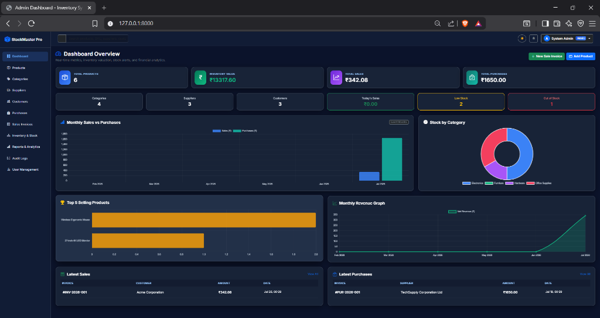

# Inventory Management System with Admin Dashboard

A production-ready, feature-complete Inventory Management System built with **Python Django**, **Microsoft SQL Server (T-SQL scripts & Django ORM)**, **Bootstrap 5 (Dark & Light Glassmorphism UI)**, and **Chart.js**.



---

## Key Features

- 🔐 **Authentication & Role-Based Access Control**:
  - Secure Login, Logout, User Profile, Password Change, Forgot Password.
  - Admin Role (Full access, User Management, Audit Logs, DB Backup) vs Staff Role.
- 📦 **Products & Category Management**:
  - Full CRUD operations with Product SKU, Barcode, Selling Price, Cost Price, Reorder Level, Image Upload, and **Automatic QR Code Generation**.
- 🤝 **Supplier & Customer Directories**:
  - Vendor directory with purchasing linkage and customer sales invoice tracking.
- 🛍️ **Purchase Order Management**:
  - Create purchase orders; **automatically increases stock quantity** and logs stock movement history.
- 🧾 **Sales & Tax Invoices**:
  - Generate POS sales invoices with subtotal, discount, GST %, and auto total calculation.
  - **Automatically decreases stock quantity** upon sale completion.
  - **Printable Tax Invoice layout** with browser print optimization (`@media print`).
- 📊 **Inventory Tracking & Stock Movements**:
  - Real-time stock status (In Stock, Low Stock, Out of Stock), Stock Valuation, and complete audit movement trail (`PURCHASE`, `SALE`, `ADJUSTMENT`).
- 📈 **Interactive Admin Dashboard & Analytics**:
  - Glassmorphism KPI cards for Financial Valuation, Sales, Purchases, Stock Alerts.
  - **Chart.js Graphs**: Monthly Sales vs Purchases, Stock Category breakdown pie chart, Top 5 selling products bar chart, Net Revenue trend line.
- 📄 **Reports & Data Export**:
  - Sales, Purchase, Product, Supplier, Customer, Inventory, and Profitability reports.
  - Daily, Weekly, Monthly, and Yearly period filtering.
  - **Export to Excel (`.xlsx`)**, **Export to PDF**, and Print.
- 🛡️ **Audit Logging & Database Backup**:
  - Action audit log tracking user IP, timestamp, and activity.
  - One-click JSON Database Backup utility.
- 🗄️ **Microsoft SQL Server Integration**:
  - Dual database engine support (configured for SQL Server via `mssql-django` / `pyodbc` or local SQLite fallback).
  - Complete T-SQL script suite under `sql_scripts/` containing tables, check constraints, views, stored procedures, functions, triggers, and seed data.

---

## Default Login Credentials

| Role | Username | Password |
| :--- | :--- | :--- |
| **Admin** | `admin` | `admin123` |
| **Staff** | `staff1` | `staff123` |

---

## Quick Start Guide

### 1. Activate Environment & Install Dependencies
```bash
# Windows PowerShell
.\venv\Scripts\Activate.ps1

# Install requirements
pip install -r requirements.txt
```

### 2. Apply Database Migrations & Seed Sample Data
```bash
# Run Django Migrations
python manage.py migrate

# Seed rich sample inventory data
python manage.py seed_inventory_data
```

### 3. Start Development Server
```bash
python manage.py runserver
```
Open your browser and navigate to `http://127.0.0.1:8000/`.

---

## Microsoft SQL Server Integration Guide

To connect directly to Microsoft SQL Server:

1. **Execute T-SQL Scripts on SQL Server**:
   - Run `sql_scripts/01_tables_constraints.sql` to create tables, constraints, and indexes.
   - Run `sql_scripts/02_views_procedures_triggers.sql` to create views, stored procedures, functions, and triggers.
   - Run `sql_scripts/03_seed_data.sql` to insert initial seed data.

2. **Configure Environment Variables / Django Settings**:
   Set `USE_SQL_SERVER=True` in environment or set `USE_SQL_SERVER = True` in `inventory_system/settings.py`:
   ```python
   DATABASES = {
       'default': {
           'ENGINE': 'mssql',
           'NAME': 'InventoryDB',
           'USER': 'sa',
           'PASSWORD': 'YourStrongPassword123',
           'HOST': 'localhost',
           'PORT': '1433',
           'OPTIONS': {
               'driver': 'ODBC Driver 17 for SQL Server',
           },
       }
   }
   ```

---

## Project Folder Structure

```
Inventory management system/
├── apps/
│   ├── authentication/    # Login, Profile, Password Change, User Mgmt
│   ├── dashboard/         # Dashboard KPIs, Chart.js API, Global Search
│   ├── products/          # Products & Categories CRUD, QR Codes
│   ├── contacts/          # Suppliers & Customers CRUD
│   ├── transactions/      # Purchases & Sales Invoices, Stock Signals
│   ├── inventory/         # Stock Overview & Stock Movement Logs
│   ├── reports/           # Financial Reports, Excel & PDF Export
│   └── audit/             # Audit Log & DB Backup Utility
├── inventory_system/      # Django Settings & Master URL Routing
├── sql_scripts/           # T-SQL Scripts for Microsoft SQL Server
│   ├── 01_tables_constraints.sql
│   ├── 02_views_procedures_triggers.sql
│   └── 03_seed_data.sql
├── static/                # CSS (Glassmorphism), JS (Chart.js Engine), Images
├── templates/             # Bootstrap 5 Dark Theme HTML Templates
├── media/                 # Product Images & Generated QR Codes
├── manage.py              # Django CLI
├── requirements.txt       # Dependencies List
└── README.md              # Project Documentation
```
